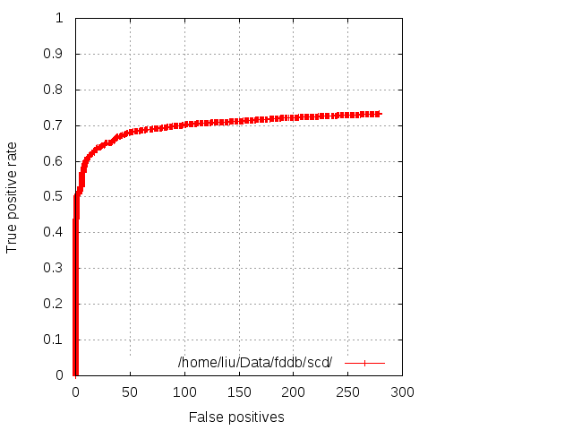
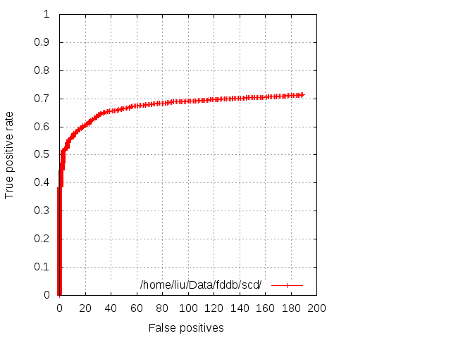

SCD: SURF-Cascade Detection
===========================

What's SCD?
-----------

The paper refers to:
Learning SURF Cascade for Fast and Accurate Object Detection, Jianguo Li, Yimin Zhang, CVPR 2013

This implementation is heavily modified, most notably, this implementation uses
vanilla SURF feature rather than the T2 feature proposed in the paper. This
implementation also supports color images.

How it works?
-------------

	> cd ./bin
	> ./scddetect <Your Image contains Faces> ../samples/face.sqlite3 | ./bbfdraw.rb <Your Image contains Faces> output.png
	> open output.png

What about the performance?
---------------------------

The tests are performed with FDDB dataset (http://vis-www.cs.umass.edu/fddb/)

After the dataset is downloaded and unzipped (http://vis-www.cs.umass.edu/fddb/index.html#download).
The evaluation tools are downloaded, unzipped, and compiled (http://vis-www.cs.umass.edu/fddb/results.html).

I mainly compared this implementation with the state of the art frontal face
detector implementations and the BBF implementation as is. scdfmt.rb script
is provided to convert rectangle format from BBF or SCD to ellipse format which
seems provide a better result on FDDB dataset.

Use the following command to convert the file list from FDDB with `.jpg` suffix:

	> sed 's/$/.jpg/' <directory to FDDB folds>/FDDB-fold-01.txt > FDDB-fold-01-jpg.txt

The following command will generate outputs that evaluation script understands:

	> ./scddetect FDDB-fold-01-jpg.txt ../samples/face.sqlite3 <directory to actual image> | ./scdfmt.rb > <directory to output where evaluation script wants>/fold-01-out.txt

After all 10 folds completed, run:

	> ./runEvaluate.pl

Please make sure the evaluation mode is ellipse format.

The following graph will likely to be generated:

The threshold is tuned to generate about 200~300 false positives.

The BBF implementation can be evaluated too:

	> ./bbfdetect FDDB-fold-01-jpg.txt ../samples/face <directory to actual image> | ./scdfmt.rb > <directory to output where evaluation script wants>/fold-01-out.txt

The generated graph:

You can compare the performance with the state of the art face detectors on
FDDB website, at about 250 false positives, this implementation at 72.93% is 4.23%
shorter than the best frontal face detector (SURF-Cascade Frontal, 77.16% detection
rate). At around same false positives, OpenCV's frontal face implemenation is at
45.18% detection rate, and the BBF implementation is at 66.27% detection rate with
the same false positives.

What about the speed?
---------------------

One reason why BBF implementation, despite its rather unimpressive performance,
still provided in ccv is its speed. At the longest time, BBF implementation or
more accurately, its derivative is the only one that can run semi-real time on
modern JavaScript engines. Although there is no plan to port SCD implemenation
to JavaScript, its native code performance is only twice as slow as BBF (OpenCV
is about 3 times slower than BBF with single thread setup), thus, showing
promising sign will eventually be on par or faster, and finally replace BBF
implementation. This performance requires to run `./scddetect` with default
parameters (the parameters for FDDB run from 24x24 size, whereas the default
parameters run from 48x48 size), and operating with grayscale images (load image
with `CCV_IO_GRAY | CCV_IO_ANY_FILE` parameter).

	> ./scddetect addams-family.png ../samples/face.sqlite3
	total : 7 in time 381ms
	> ./bbfdetect addams-family.png ../samples/face
	total : 7 in time 182ms

With these parameters, we are obviously incurring some penalties elsewhere.
At 190 false positives, SCD with 48x48 template and grayscale images has 71.41%
detection rate, where as SCD with 24x24 template and color image has 72.11%
detection rate. The BBF implementation has 65.11% detection rate at the same
false positives.

How to train my own detector?
-----------------------------
